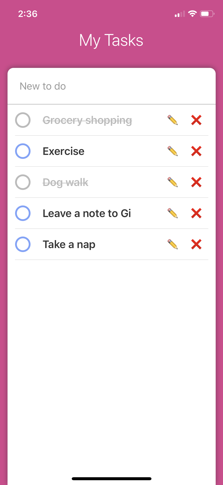

# Life is endless tasks - simple to-to app
This is my first to-do app using React native for pratice and fun.

## How to set up
1. NPM and a Command Line tool is needed.
2. git clone this repo and cd into the project folder
3. run `npm install` 
4. run `npm start` to view on expo browser

Android apk download: https://expo.io/artifacts/d243c8e5-d592-4fd5-a025-eb9b3cc5fe21

## Technologies and skills used
React Native

## Screenshots

    

    

## Initial ideation and planning
** * MVP :  The user can type a task into an input box and save in the todo list  The user can complete and uncomplete the task by clicking a button.  The user can edit and delete the tasks.**

* Advanced features : title and description 
more task statues : pending, in progress, due date etc..  

* Programming perspective:
can simply work with states on react components without using redux. 
store ToDo items into an array or an object and deal with them.

##  Testing
built on expo iso simulater and final app tested on My own Iphone X and Android simulater.

## What's next..

* To-do items order update : when you change the task statue to Done, it stacks on the top of the list now. 
Done tasks go on the bottom of the lists of stay in the same position. 

* Advanced feature add: task title and description function can be added.

* App icon design : cool app icon design needed.

* iso build : is it impossible without paying account..?

